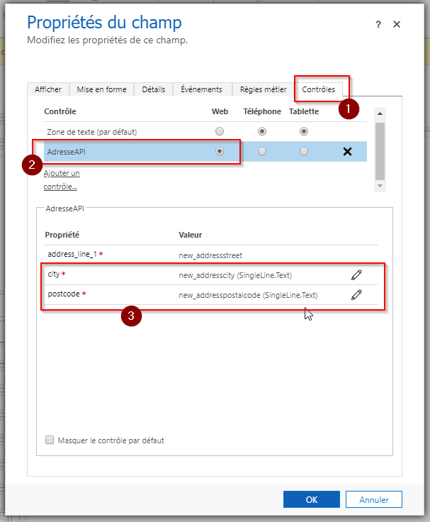
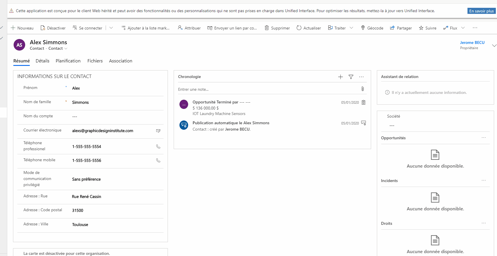

# AdresseAPI
 
Custom Control for the french address.

Installation step by step : 

1 - Import the managed solution contains in "AddressAPI_Solution\bin\Release\AddressAPI_Solution.zip" on your CRM  
2 - Open the form on which you want add the PCF  
3 - Select the field corresponding to the street of the address to configure the PCF  
4 - On the tab "Control" add the PCF and select in which case you want display it  
5 - Below you need to select fields corresponding to the postal code and the city  
6 - Publish  
 

# Demo 

